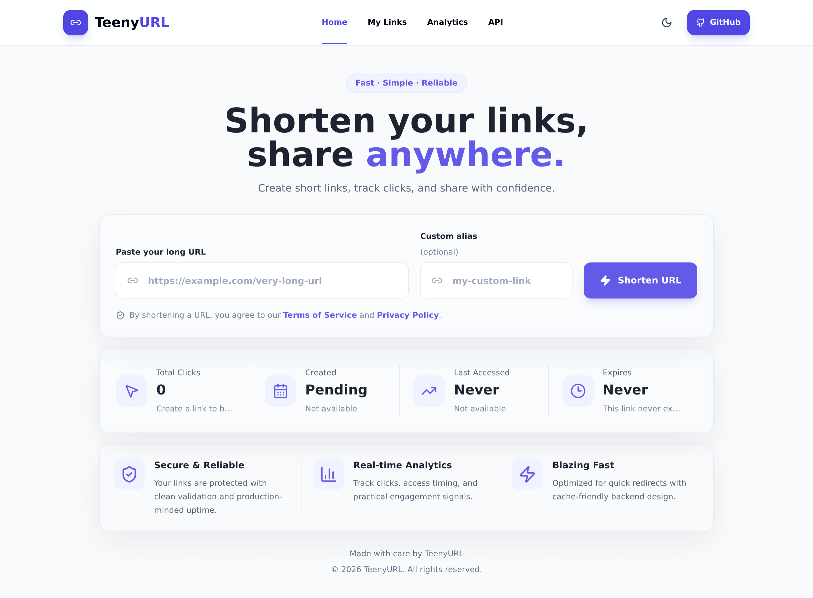
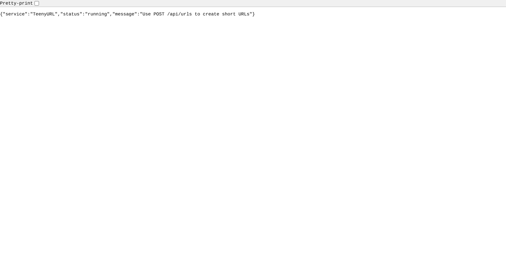

# TeenyURL

TeenyURL is a production-inspired URL shortener built to demonstrate clean backend architecture, distributed-system fundamentals, and a recruiter-friendly full-stack workflow.

It supports short-link creation, fast redirects, PostgreSQL persistence, Redis caching, per-IP rate limiting, expiration, and asynchronous analytics.

## Live Demo

- Frontend: `https://teenyurl-gamma.vercel.app/`
- Backend health: `https://teenyurl-lena.onrender.com/health`
- API base URL: `https://teenyurl-lena.onrender.com`


## Tech Stack

- Frontend: React, Vite, TailwindCSS
- Backend: Java 21, Spring Boot, Maven
- Data: PostgreSQL, Redis
- Testing: JUnit 5, Spring Boot integration tests, H2 for test isolation
- Deployment: Docker, Docker Compose, Render-ready backend, Vercel or Netlify-ready frontend

## Architecture Overview

```text
React + Vite frontend
        |
        v
Spring Boot REST API
        |
        +--> PostgreSQL source of truth
        +--> Redis redirect cache
        +--> Redis or in-memory rate limiter
        +--> Async analytics worker
```

Backend packages follow a layered structure:

- `controller`: REST endpoints and redirects
- `service`: URL creation, redirect lookup, caching, analytics, rate limiting
- `repository`: Spring Data persistence
- `model`: JPA entities
- `dto`: request and response payloads
- `config`: application wiring and CORS/logging/rate-limit configuration
- `exception`: consistent JSON error responses

## System Design

- React frontend: Vite SPA for creating short links and viewing stats from the REST API.
- Spring Boot backend: stateless API layer designed to run behind a load balancer.
- PostgreSQL persistence: durable source of truth for URL mappings and daily click rollups.
- Redis caching: hot redirect mappings are cached with TTLs to keep redirects fast.
- Rate limiting: configurable fixed-window limits protect create requests, with Redis-backed limits for multi-instance deployments.
- Async analytics: redirects publish events and return quickly while click counters and request metadata update in the background.
- Docker deployment: Compose runs the app, PostgreSQL, and Redis locally; the backend Dockerfile supports hosted container deployment.

## Features

- Create short URLs with generated Base62 codes.
- Optional custom aliases with validation and collision checks.
- Redirect by short code with cache-first lookup.
- Optional expiration dates for links.
- Privacy-aware analytics with daily clicks, last access time, user agent, referrer, and salted IP hash.
- Redis-backed redirect caching and distributed rate limiting.
- Health and metrics endpoints for production readiness.
- Consistent JSON error responses.
- Configurable CORS, API key protection, request logging, and private-network redirect protection.
- React frontend for link creation and summary stats.

## Screenshots

```md


```

## API Endpoints

| Method | Endpoint | Description |
| --- | --- | --- |
| `POST` | `/api/urls` | Create a short URL. |
| `GET` | `/{shortCode}` | Redirect to the original URL. |
| `GET` | `/api/urls/{shortCode}/stats` | Return analytics for a short URL. |
| `GET` | `/health` | Check database and Redis readiness. |
| `GET` | `/metrics` | Return lightweight service metrics. |

Create request:

```json
{
  "originalUrl": "https://example.com/articles/123",
  "customAlias": "optional-alias",
  "expiresAt": "2026-12-31T23:59:59"
}
```

Create response:

```json
{
  "shortCode": "abc123",
  "shortUrl": "http://localhost:8080/abc123",
  "originalUrl": "https://example.com/articles/123",
  "expiresAt": "2026-12-31T23:59:59"
}
```

If `TEENYURL_CREATE_API_KEY` is set, include it on create requests:

```text
X-API-Key: replace-with-a-long-random-secret
```

See `docs/api.md` for more response examples.

## Environment Variables

Only commit `.env.example` files. Keep real `.env`, `.env.local`, `.env.production`, and hosting-provider secrets out of Git.

| Variable | Used By | Required | Example | Notes |
| --- | --- | --- | --- | --- |
| `APP_PORT` | Docker Compose | No | `8080` | Host port for the backend container. |
| `POSTGRES_DB` | Docker Compose | No | `teenyurl` | Local database name. |
| `POSTGRES_USER` | Docker Compose | No | `teenyurl` | Local database user. |
| `POSTGRES_PASSWORD` | Docker Compose | Yes locally | `change-me-local-only` | Use a real secret outside local development. |
| `SPRING_DATASOURCE_URL` | Backend | Yes in production | `jdbc:postgresql://host:5432/db` | JDBC URL for PostgreSQL. |
| `SPRING_DATASOURCE_USERNAME` | Backend | Yes in production | `teenyurl_app` | Database username. |
| `SPRING_DATASOURCE_PASSWORD` | Backend | Yes in production | `replace-with-db-password` | Store only in environment settings. |
| `REDIS_URL` | Backend render profile | Yes in production | `redis://host:6379` | Used by hosted Redis providers. |
| `REDIS_HOST` | Backend local profile | No | `localhost` | Local Redis host when `REDIS_URL` is not used. |
| `REDIS_PORT` | Backend local profile | No | `6379` | Local Redis port. |
| `TEENYURL_ANALYTICS_IP_HASH_SALT` | Backend | Yes in production | `replace-with-long-random-salt` | Must be unique per deployment. |
| `TEENYURL_CREATE_API_KEY` | Backend | No | `replace-with-long-random-secret` | Enables API-key protection for URL creation when set. |
| `TEENYURL_CORS_ALLOWED_ORIGINS` | Backend | Yes in production | `https://your-frontend.example.com` | Comma-separated trusted frontend origins. |
| `TEENYURL_SHORT_CODE_NODE_ID` | Backend | Yes for multiple instances | `0` | Use a unique node ID per app instance. |
| `TEENYURL_CACHE_REDIS_ENABLED` | Backend | No | `true` | Enables Redis redirect caching. |
| `TEENYURL_RATE_LIMIT_REDIS_ENABLED` | Backend | No | `true` | Enables shared Redis-backed rate limits. |
| `VITE_API_BASE_URL` | Frontend | Yes | `http://localhost:8080` | Backend origin only, without `/api/urls`. |

## Local Setup

Clone the repository and create local env files:

```powershell
Copy-Item .env.example .env
Copy-Item frontend/.env.example frontend/.env
```

Install frontend dependencies:

```powershell
cd frontend
npm install
```

Run only PostgreSQL and Redis in Docker:

```powershell
cd ..
docker compose up -d postgres redis
```

Run the backend from `backend/`:

```powershell
cd backend
.\mvnw.cmd spring-boot:run
```

Run the frontend from `frontend/` in a second terminal:

```powershell
cd frontend
npm run dev
```

Open the Vite URL, usually `http://localhost:5173`.

## Docker Compose

Run the full local stack from the repository root:

```powershell
docker compose up --build
```

Run in the background:

```powershell
docker compose up --build -d
```

Check readiness:

```powershell
Invoke-RestMethod http://localhost:8080/health
```

Stop the stack:

```powershell
docker compose down
```

Remove local PostgreSQL and Redis volumes too:

```powershell
docker compose down -v
```

## Testing

Backend tests:

```powershell
cd backend
.\mvnw.cmd test
```

Frontend production build:

```powershell
cd frontend
npm run build
```

Optional backend compile check:

```powershell
cd backend
.\mvnw.cmd compile
```

## Deployment Notes

Backend:

- Deploy as a Docker web service from `backend/Dockerfile`.
- Set `SPRING_PROFILES_ACTIVE=render` when using a hosted Redis URL.
- Store database, Redis, API key, and analytics salt values only in the hosting provider's environment settings.
- Use `/health` as the readiness check.
- Use a unique `TEENYURL_SHORT_CODE_NODE_ID` per backend instance.

Frontend:

- Deploy `frontend/` to Vercel or Netlify as a Vite app.
- Set `VITE_API_BASE_URL` to the deployed backend origin.
- Add the deployed frontend domain to `TEENYURL_CORS_ALLOWED_ORIGINS` on the backend.
- Redeploy the frontend after changing `VITE_API_BASE_URL`.

Security:

- Do not commit `.env`, `.env.local`, `.env.production`, database URLs with credentials, Redis URLs with credentials, salts, API keys, or service tokens.
- Rotate any value that was ever committed publicly.
- Restrict `/metrics` at the ingress or network layer if exposing operational data is not desired.


## Future Improvements

- User accounts and authenticated link management.
- Admin dashboard for analytics and abuse monitoring.
- QR code generation for short links.
- Durable event queue for analytics processing.
- Database migrations with Flyway or Liquibase.
- CI workflow for backend tests and frontend builds.
- Public screenshots and deployed demo links.
